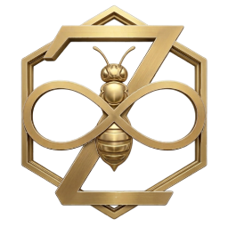
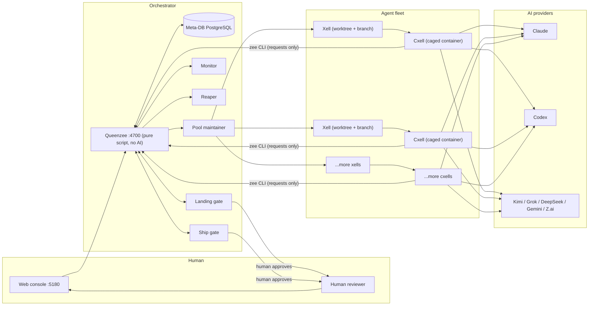

<p align="center">
  
</p>

<h1 align="center">ZEEHIVE</h1>

<p align="center">
  <strong>A deterministic agent-environment orchestrator that evolves itself.</strong><br>
  Start it — it clones this repo, onboards itself as its first project, and is ready to
  onboard other projects and cut isolated environments for AI agents to work in.
</p>

<p align="center">
  <a href="#quickstart"></a>
  <a href="#how-it-works"></a>
  <a href="#the-gates"></a>
  <a href="#developing-zeehive"></a>
</p>

---

## What is ZEEHIVE?

ZEEHIVE is a control plane for **a fleet of AI agents that write code** — and it uses itself to
build its own improvements. On first boot it clones this repo, onboards itself as its first
project, and is then ready to onboard **any other project** on your machine or from GitHub, cutting
isolated environments (**xells**) for AI agents to work in.

Each agent gets a reproducible workspace with its own git branch, database and containers, and a
human gate stands in front of every irreversible action — landing on `main`, shipping to
production, touching production data.

The core idea is simple:

> **Provisioning is deterministic and belongs in a script; the AI should only do the actual work,
> starting from a proven-correct environment — and anything irreversible needs a human's click.**

It is built in Node.js and React (ES modules throughout), uses PostgreSQL as its single source of
truth, and runs on Docker. It is **local-first**: everything runs on your own machine; GitHub is
just one optional way to pull a project in. No external AI platform is required to *run* it — you
connect your own AI provider credentials (Claude, OpenAI Codex, Kimi, Grok, DeepSeek, Gemini,
Z.ai) to dispatch agents.

## Key features

- **🧱 Isolated workspaces per task** — every agent gets its own xell: a git worktree, branch,
  database and app containers. No shared state, no cross-agent interference, and no
  "works on my machine".
- **🔒 Human gates on everything irreversible** — landing on `main`, shipping to production and
  touching production data are held until a human approves the exact sha in the console.
- **🧠 Provider-agnostic with model policy** — dispatch the same task to any AI provider. Each
  project can set **harnesses** — persona + skills + memory layers that also carry *policy* on
  which providers and models suit which job, enforced at dispatch.

  <p align="center">
    
    
    
    
    
    
    
  </p>
- **🎛️ Live honeycomb console** — watch the whole fleet as colour-coded hexagons: provisioning,
  working, idle, holding, or asking a human for a land/ship/prod decision.
- **⚙️ Deterministic core** — the queenzee is pure script, no AI. Provisioning, pooling, monitoring
  and teardown are reproducible by construction; AI is invoked only at dispatch.

## Quickstart

**Requirements:** Docker. No checkout, no build — published images:

```sh
curl -fsSLO https://raw.githubusercontent.com/Originode/Zeehive/master/docker-compose.bootstrap.yml
docker compose -f docker-compose.bootstrap.yml up -d
```

On first boot, ZEEHIVE migrates its own fresh database and **self-onboards**: it clones this repo,
registers it as the `Zeehive` project, installs the landing gate, and sets the spawn template.
Then:

1. Open the console at **http://localhost:5180** (API on `:4700`)
2. Go to **Project setup → Tokens** and connect your AI provider — for Claude: run `claude setup-token` and paste the long-lived token it prints
3. Raise the **pool target** to pre-warm xells
4. Type a task into **+ new prompt** — a zee goes to work in one

**Onboard another project** the same way — **Project setup → New Project**: clone one from GitHub,
or mount an existing folder from your machine.

> **Run your own fork:** set `ZEEHIVE_SELF_REMOTE` (and `ZEEHIVE_GITHUB_TOKEN` for a private repo —
> a fine-grained PAT with Contents: Read-only) in a `.env` file next to the bootstrap compose.
> A truly fresh re-run: delete the `zeehive_meta_data` + `zeehive_repos` volumes and `up -d` again.

**Developing ZEEHIVE itself?** Clone the repo and build from source instead:

```sh
docker network create zee-hive-net
docker compose -f docker/zeehive/docker-compose.prod.yml up -d --build meta-db server web
```

That file is the build-from-source twin of the bootstrap one — same project name, same container
names, same ports — so a stack booted either way is shippable by the same scripts.

---

## How it works

### The architecture



### The vocabulary

| Term | What it is |
|---|---|
| **xource** | The source a *xell* branches from: the project's local clone and its main branch. Read-only to xells. Pushing out stays a **human act**. |
| **xell** | An isolated environment: a git worktree + its own branch + its own containers (per-xell database, server, webapp) + generated config (`.zeehive.env`). The unit the orchestrator pools, spawns, tracks, and tears down. |
| **cxell** | A *caged xell*: the locked-down container a headless zee actually works in. No docker socket, no host filesystem, a default-deny egress firewall — the queenzee API is its only door out, and every privileged verb behind that door lands on a human gate. |
| **harness** | A config layer a zee wears — persona, skills, memory — plus a **model policy**: which providers and models suit which job, enforced at dispatch. |
| **zee** | An agent (an AI model session) bound to exactly one xell, running inside its cxell. |
| **queenzee** | The orchestrator. **Pure script, no AI.** It provisions/reaps deterministically, keeps the pool warm, monitors health, runs maintenance, and executes the privileged actions humans approve. |

The console shows the fleet as a **honeycomb of hexagons**, colour-coded by activity: cold violet
(provisioning) → blue (ready/claimed) → green (working) → amber (needs attention) → orange
(production) → red (land/ship/prod being touched).

### The gates

| Gate | What it does |
|---|---|
| **Landing gate** | A zee lands work with `git push . HEAD:main` inside its xell; a git `update` hook on the xource asks the queenzee, and the push is **held** until a human approves that exact sha in the console. Fails closed. |
| **Ship gate** | Production deploys are requests; a human approves, and the *queenzee* builds from the landed main and deploys. A zee never holds the prod lock or runs a prod build. |
| **Prod data** | Binding a xell to a production database is a per-xell human grant. |
| **Done** | A zee proposes it's finished; a human's "Mark done" is what tears the cxell down. |

Plus one control that is the opposite of a gate — it stops everything until a human says otherwise:

- **Pause / play** — one button in the console statusline, fleet-wide. **Pause** interrupts every
  live zee mid-turn; **Play** calls them back with a prompt telling them what happened. Nothing is
  lost: no commit, no branch, no request, no gate is touched.

---

## Local-first, GitHub-optional

Everything ZEEHIVE does runs on your own machine. The console's **Pull** button keeps a cloned
project in step with its remote (fast-forward only); the **Push** / **open-PR** buttons appear only
when the project's stored GitHub PAT actually carries write access — and each fires only from a
human's confirmed click. A read-only token (Contents: read) is the recommended default; **a zee can
never reach those buttons**. The dev cycle itself — landing, integration, prod builds — runs
entirely on the local xource and never depends on GitHub being reachable.

## Layout

```
db/migrations/   schema, applied automatically at boot
server/src/
  api/routes.js  every HTTP route (hooks, claim, land/ship gates, self verbs, SSE stream)
  queenzee/      the loops: pool, intake, monitor, landing pad, ship gate, reaper, maintenance
  lib/           provision, cxell driver, remote-git (clone/pull, no push), self-onboard,
                 projects, terminal bridge, fleet, docker, …
web/             the console (React + Vite) — honeycomb fleet view, gates, terminals
docker/zeehive/  Dockerfile.server (the queenzee), Dockerfile.zee-agent (the cxell image),
                 Dockerfile.web, docker-compose.prod.yml, migration playbook (README.md)
scripts/         provisioning/despawn/build/ship scripts + `zee`, the ONE copy of the in-cxell
                 CLI
docs/            deploy-topology spec, manager zees, the work tracker, harnesses
```

---

## Developing ZEEHIVE

Working on ZEEHIVE (human or zee)? Start at **[CLAUDE.md](CLAUDE.md)** — it tells you which surface
you're on, the verbs that are actually yours, how to run and verify, and a map of the docs.

```sh
# Local development — one command each:
npm install
npm run db:migrate     # apply db/migrations/*.sql
npm run dev            # API (queenzee + routes) + web console together
```

Tests are standalone Node scripts in `test/` — run one directly:
`node test/<name>.test.mjs`. There is no `npm test`.

ZEEHIVE is its own first project: work on it happens in xells like any other project. A Zeehive
xell gets its own per-xell meta-DB container, and the nested queenzee inside it runs with
simulate-mode safety defaults — every provisioning, teardown, build, deploy-file and backup path is
mode-gated, so it provisions and deploys nothing.

## License

UNLICENSED — all rights reserved.
